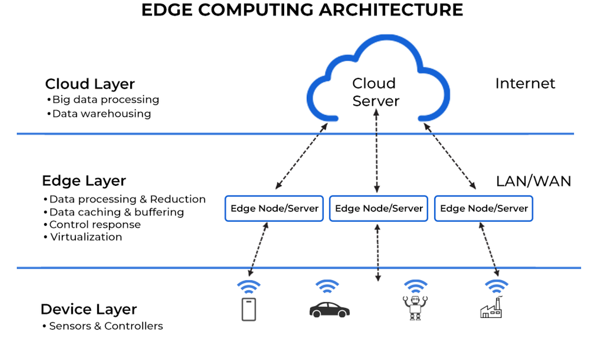
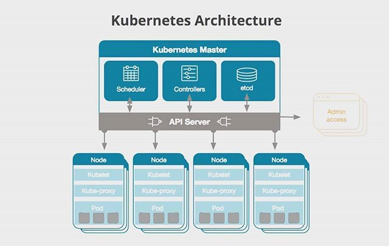
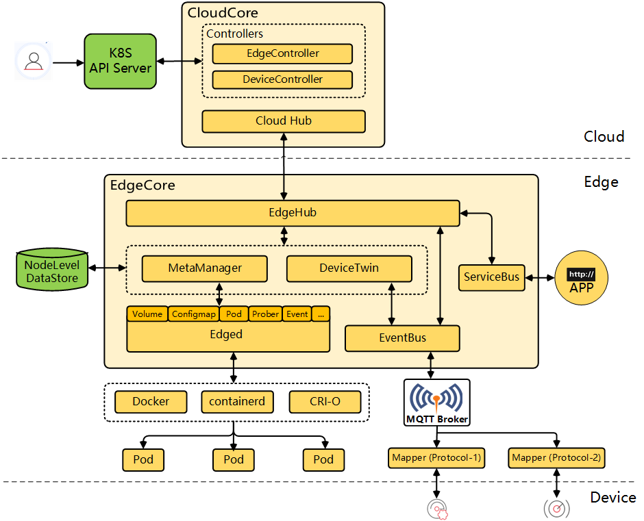
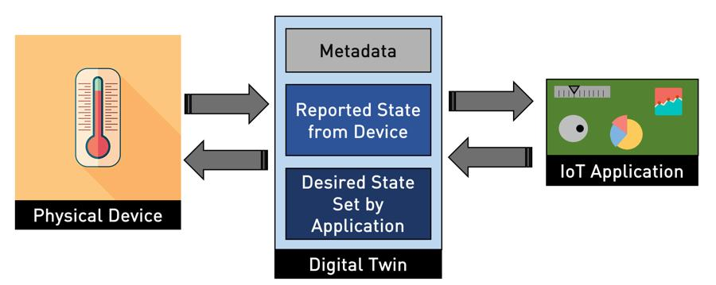

# KubeEdge

KubeEdge is an open-source system that extends native containerized application orchestration and device management to hosts located at the Edge. It is built upon Kubernetes and provides the core infrastructure support for networking, application deployment, and metadata synchronization between the cloud and the edge. 

Managing edge applications means dealing with unreliable networks, resource constraints, device integration complexity, and the need to maintain separate management tools for the edge and the cloud. With KubeEdge, it is possible to use standard Kubernetes APIs to manage both cloud and edge workloads, thanks to integrated device management, offline functionality, and automatic synchronization. It provides a unified platform to build, deploy, and manage edge applications, simplifying the management of unstable connections and resource-constrained environments. By leveraging the strengths of Kubernetes, KubeEdge ensures that edge devices benefit from the same orchestration and management that Kubernetes offers in traditional cloud environments.

---

### Kubernetes

Kubernetes is a container orchestrator that handles the automated configuration, management, and coordination of a cluster—a set of diverse operating machines called nodes. The system operates on a continuous Control Loop: it checks the current state, compares it with the desired state (defined in YAML files), and acts to correct the differences. If you declare that you want 3 replicas of an app and one dies, Kubernetes notices and starts a new one.

A Kubernetes cluster is divided into two main areas:

* **Control-plane**: Usually resides in the cloud or in a stable data center. It makes global decisions, maintaining the declared state.
  * *API Server*: All cluster components communicate only with this component (called via the `kubectl` command).
  * *etcd*: An ultra-reliable key-value database that saves the state of the entire cluster.
  * *Scheduler*: Decides which physical/virtual node your application should run on based on available resources.
  * *Controller Manager*: Executes the control loops.
* **Worker Node**: These are the machines (or VMs) where your applications actually run. On each of these runs:
  * *Kubelet*: Takes orders from the API Server (e.g., "start this container") and constantly reports the node's health status back to it.
  * *Kube-Proxy*: Makes the service available externally, routes communication to other pods, and performs load balancing.

---

## KubeEdge Architecture

KubeEdge steps in to physically separate the control-plane and Worker nodes. It was created because the standard Kubelet is too heavy for edge nodes (often small IoT devices) and, most importantly, panics if it loses its internet connection with the API Server. The main components are:

* **CloudCore**: The cloud-side component that runs in the Kubernetes cluster. It is the central node that manages all Edge nodes and cloud-edge communication.
  1. **CloudHub**: A web socket server responsible for monitoring cloud-side changes, caching, and sending messages to the EdgeHub.
  2. **EdgeController**: An extended Kubernetes controller that manages the metadata of edge pods and nodes, so that data can be routed to a specific edge node.
  3. **DeviceController**: An extended Kubernetes controller that provides the cloud representation of edge devices. It synchronizes the states between the cloud and the edge, allowing cloud applications to interact with physical devices natively via Kubernetes APIs as if they were local.
* **EdgeCore**: A lightweight edge-side Kubernetes agent that runs on every edge node. It manages containers and communicates with the cloud.
  1. **EdgeHub**: A web socket client that interacts with the cloud service. This includes synchronizing cloud-side resource updates to the edge and reporting edge-side host and device state changes to the cloud.
  2. **Edged**: A lightweight kubelet replacement for edge nodes, and it manages containerized applications.
  3. **EventBus**: An MQTT client for interacting with MQTT servers (mosquitto), offering publish and subscribe capabilities to other components. It's used to communicate with applications running on edge via MQTT.
  4. **ServiceBus**: An HTTP client for interacting with HTTP servers (REST), offering HTTP client capabilities to cloud components to reach HTTP servers running at the edge. It's used to communicate with applications running on edge via HTTP.
  5. **Device Twins**: An edge-side module that maintains the digital twin of your physical device locally. It keeps the device's actual and desired states synchronized, ensuring autonomous operation and local MQTT communication even during cloud disconnections.

---

### Device Twins

Device Twins (often referred to as **digital device twins**) are software representations of physical devices that mirror the identity, configuration, state, telemetry data, and history of each device in a backend system. It includes properties, behaviors and relationships that it has in physical world, serving as a bridge between the physical and digital worlds. A device twin acts as the *single source of truth* regarding the object's characteristics, configuration settings, and current activities.

In KubeEdge, Device Twins simplify the management and security of multiple devices by:

* Centralizing device configuration and reducing manual configuration errors.
* Enabling faster troubleshooting thanks to a comprehensive history of states and events.
* Supporting predictive maintenance using telemetry trends.
* Making firmware updates safer through clear monitoring of device status.
* Improving reliability through early anomaly detection.
* Providing auditable records for compliance and incident response purposes.

KubeEdge supports device management with the help of Kubernetes CRDs[^1] and Device Mappers corresponding to the one being used. Two elements are used to define the device:

* **Device Model**: A Device Model describes the properties of devices of a specific type. A Device Model is a Physical Model that defines the properties and parameters of physical devices.
* **Device Instance**: Represents the actual object. The device specifications are static and include the list of the device's properties; they describe the details of each property, including name, type, and access method.

[^1]**CustomResourceDefinitions**: An API that allows defining customizable resources. The Kubernetes API then takes care of managing the resource, without having to write a dedicated API server.

---

## KubeEdge Benefits

KubeEdge unifies operations across cloud and edge environments, ensuring consistent management and deployment strategies without the complexity of maintaining separate systems.

### 1. Native Kubernetes API at the Edge

This feature allows developers and operators to use familiar Kubernetes tools and procedures, whether they are deploying applications in cloud data centers or in an edge environment. It also ensures that the same orchestration and management strategies are consistent across all environments, driving efficiency and reducing the learning curve. This approach also reduces the need for tailor-made solutions designed exclusively for edge deployments.

### 2. Resilience

It ensures that workloads continue to run even in the event of network outages or hardware failures. By handling disconnections smoothly and ensuring continuity through local caching mechanisms, KubeEdge provides a resilient operating environment.

Furthermore, KubeEdge incorporates health checking and self-healing mechanisms. These features enable the automatic detection and resolution of issues, maintaining the reliability and stability of edge deployments. This guarantees that services remain available and performant, a critical requirement for mission-critical edge applications.

### 3. Low Resource Utilization

KubeEdge is designed to run efficiently in resource-constrained environments. From minimizing compute resource requirements to optimizing memory usage, KubeEdge ensures that edge applications can run effectively even on devices with limited capabilities. This low resource footprint makes it suitable for a wide range of edge devices, from IoT sensors to edge servers.

### 4. Scalability

KubeEdge supports the horizontal scaling of applications across multiple edge nodes, ensuring that as demand increases, resources can be added accordingly.

The KubeEdge architecture also supports efficient resource management across a distributed set of edge nodes. This facilitates scaling operations, making it easy to deploy large-scale edge applications.

### 5. Optimized for Edge Environments

KubeEdge supports edge-specific configurations, such as node affinity and local storage, to ensure that workloads run efficiently even in resource-constrained contexts.

Moreover, its architecture is designed to handle network disruptions and low-latency requirements, ensuring that applications remain operational and responsive. This combination of familiar deployment processes and edge-centric optimizations makes KubeEdge a powerful tool for extending the reach of Kubernetes to the edge.

---

## Use Cases

KubeEdge proves effective in all those distributed environments that need speed and lightness at the edge, in particular:

* **Smart Manufacturing**: Imagine having many factories scattered around the world, with each plant possessing edge nodes running quality control apps, predictive maintenance... sensors that need real-time processing. With KubeEdge, you can push updates to all edge nodes in the plant from a centralized cloud control plane, manage device connectivity via MQTT, and ensure business continuity even during network outages.
* **Autonomous Vehicles**: If I have a network of many vehicles, each of which is essentially an edge node that needs to process data, make local decisions, and sync with the cloud for updates and route optimization. KubeEdge allows treating them as k8s nodes and managing the entire fleet using its tools.
* **Retail Edge**: Consider a retail chain with numerous stores, each managing inventory systems, customer analytics, and point-of-sale systems on local edge hardware. These stores must operate independently in the event of network outages but synchronize data when connectivity is available. KubeEdge handles this seamlessly, allowing new features to be deployed centrally while maintaining local autonomy.
* **Smart City Infrastructure**: Imagine managing traffic lights, air quality monitoring sensors, security cameras, and public Wi-Fi networks across an entire city. Each intersection or zone features edge nodes that process data locally to ensure an immediate response, while simultaneously contributing to city-wide data analysis in the cloud. KubeEdge provides the framework needed to orchestrate this complex and distributed system as if it were a single Kubernetes cluster.
* **Industrial IoT**: When you need to deploy a firmware update or implement new analytics algorithms, instead of manually updating each individual location, you can update the definition once in the cloud control plane and KubeEdge automatically distributes it to all corresponding edge nodes.

---

# Resources
* [KubeEdge documentation](https://kubeedge.io/docs/)
* [KubeEdge for Beginners: My Complete Journey from Zero to Contributing in Cloud-Native Edge Computing](https://medium.com/@abhishekrajputji2004/kubeedge-for-beginners-my-complete-journey-from-zero-to-contributing-in-cloud-native-edge-71169fd8df60)
* [KubeEdge, a Kubernetes Native Edge Computing Framework](https://kubernetes.io/blog/2019/03/19/kubeedge-k8s-based-edge-intro/)
